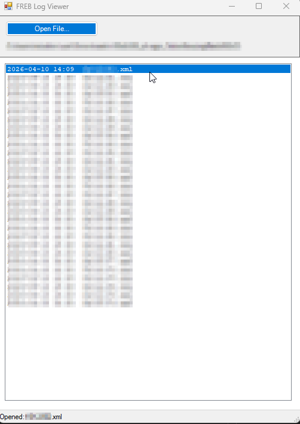
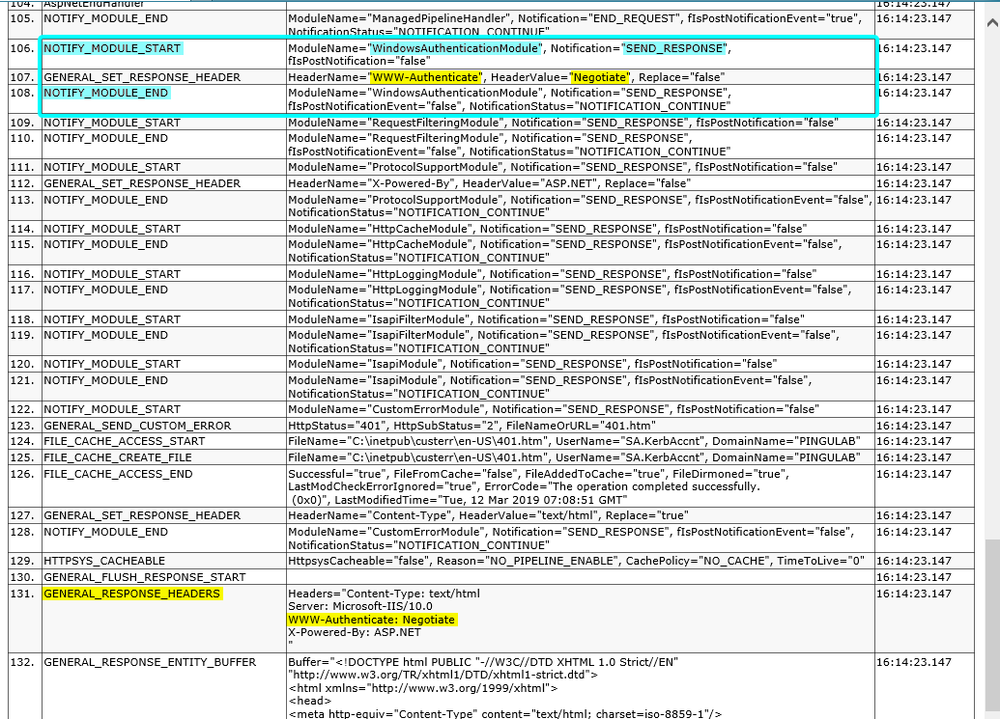

# FREB Log Viewer

A lightweight Windows PowerShell GUI for browsing and reading **IIS Failed Request Tracing (FREB)** XML log files.  
Renders each log through its `freb.xsl` stylesheet so you see the same rich HTML view you would get in a browser, without needing to host the files on a web server.

---

## Screenshots

> **Main window, file list**
>
> 

---

> **Log viewer, Request Summary tab**
>
> 

---

## Requirements

| Requirement | Notes |
|---|---|
| Windows | Any version that ships PowerShell 5.1 (Windows 10 / Server 2016 or later) |
| PowerShell 5.1 | Pre-installed on Windows 10/11 and Windows Server 2016+ |
| .NET Framework 4.x | Pre-installed on the above OS versions |
| `freb.xsl` | Must be present in the same folder as the XML log files (IIS copies it there automatically) |

---

## Quick Start

1. Copy the viewer folder (containing `FrebViewer.bat`, `Start-FrebViewer.ps1`, and the `Services\` subfolder) to any location on your machine.
2. Double-click **`FrebViewer.bat`**.
3. Click **Open File...** in the toolbar.
4. Browse to a FREB XML file (e.g. `fr000001.xml`) and click **Open**.
5. The viewer loads all XML files from that folder into the list, sorted newest-first.
6. Click any entry in the list to open a full-screen rendered view of that log.

> **Tip, launch with a pre-loaded folder:**  
> You can pass a folder path directly from PowerShell to skip the file picker:
> ```powershell
> powershell.exe -NoProfile -ExecutionPolicy Bypass -STA -File ".\Start-FrebViewer.ps1" `
>     -FolderPath "C:\inetpub\logs\FailedReqLogFiles\W3SVC2"
> ```

---

## Using the App

### Main Window

| Area | Purpose |
|---|---|
| **Open File...** button | Opens a file picker; automatically loads all `*.xml` files from the chosen file's folder |
| **Directory label** | Shows the currently loaded folder path |
| **File list** | All FREB XML logs in the folder, sorted by date descending. Click any row to open its viewer |
| **Status bar** | Displays current action or count of loaded files |

### Log Viewer Window

Each selected log opens in a separate maximised window.  
If `freb.xsl` is found alongside the XML files, the log is rendered as a full HTML report with:

- **Request Summary**, URL, verb, status code, time taken, failure reason, remote IP
- **Compact View**, the full IIS pipeline execution step by step, with module names and timings
- **Request / Response headers**, including cookies and the request body (for POST requests)

If no `freb.xsl` is found, the raw XML is displayed in a monospace fallback view.

---

## File Structure

```
FrebViewer.bat              ← Double-click to launch
Start-FrebViewer.ps1        ← Main UI script
Services\
  FrebFileService.ps1       ← File discovery & XSL path resolution
  FrebXmlService.ps1        ← XSL-to-HTML transformation
README.md                   ← This file
```

Your FREB log folder (separate from the viewer itself) looks like:

```
C:\inetpub\logs\FailedReqLogFiles\W3SVC2\
  freb.xsl          ← Stylesheet copied by IIS automatically
  fr000001.xml
  fr000002.xml
  ...
```

---

## How to Enable IIS Failed Request Tracing

> For a thorough explanation of what FREB is and how to read the logs, refer to the official Microsoft IIS Support Blog article:  
> **[Reading a FREB log, IIS request processing pipeline execution](https://techcommunity.microsoft.com/blog/iis-support-blog/reading-a-freb-log-a-failed-request-tracing-iis-request-processing-pipeline-exec/1349639)**  
> *(Published by the IIS Support team, Microsoft Tech Community)*

The steps below are a concise summary. The blog article above has full screenshots for each step.

### Step 1, Install the Tracing feature

The **Tracing** role service is not installed by default.

- Open **Server Manager → Add Roles and Features**
- Under **Web Server (IIS) → Health and Diagnostics**, check **Tracing**
- Complete the wizard

### Step 2, Add a tracing rule

1. Open **IIS Manager**
2. Select the site or application you want to trace (rules can be scoped per sub-application)
3. Double-click **Failed Request Tracing Rules**
4. Click **Add…** in the Actions pane
5. Choose what to trace:
   - **All content** (`*`) or a specific URL
   - Status codes to capture (e.g. `500` for server errors, `4xx` for client errors)
   - Or a time threshold (e.g. requests taking longer than 5 seconds)
6. Leave the default verbosity settings and click **Finish**

### Step 3, Enable tracing for the site

> Rules alone are not enough, tracing must also be enabled to actually write logs to disk.

1. In **IIS Manager**, select the **site** (not a sub-application)
2. In the **Actions** pane, click **Failed Request Tracing…**
3. Check **Enable** and optionally adjust the log directory and the maximum number of files
4. Click **OK**

> **Important:** Tracing has a small performance overhead. Disable it again once you have collected the logs you need.

### Default log location

```
C:\inetpub\logs\FailedReqLogFiles\W3SVC<N>\
```

Where `<N>` is the numeric site ID shown in IIS Manager under the **Sites** node.  
IIS places a `freb.xsl` stylesheet in this folder automatically, this viewer relies on that file to render the logs.

---

## Understanding the Log Views

The blog article linked above has a detailed walkthrough. Key things to look for:

| What to look for | Where |
|---|---|
| Response status code & failure reason | **Request Summary** tab, top of the page |
| Which module set the error status | **Request Summary**, look for the module name next to the status code |
| How long each pipeline stage took | **Compact View**, rightmost "Time Taken" column |
| Request headers and cookies | **Compact View**, look for `GENERAL_REQUEST_HEADERS` |
| POST body sent by the client | **Compact View**, look for `REQUEST_ENTITY` |
| Response body returned by server | **Compact View**, look for `RESPONSE_ENTITY` |
| Authentication failures (401.x) | **Compact View**, look for `AUTHENTICATE_REQUEST` stage |
| Authorization failures (403.x) | **Compact View**, look for `AUTHORIZE_REQUEST` stage |

---

## Troubleshooting

**The list is empty after selecting a file.**  
Confirm that there are `*.xml` files in the same folder as the file you selected and that you have read permission on the folder.

**The viewer shows raw XML instead of the rendered report.**  
The `freb.xsl` stylesheet was not found in the folder or any parent folder. Copy `freb.xsl` from `C:\inetpub\logs\FailedReqLogFiles\W3SVC<N>\` alongside your XML files.

**The form does not open / PowerShell error about STA.**  
Always launch via `FrebViewer.bat`. Running `Start-FrebViewer.ps1` directly in a default PowerShell session (which runs in MTA mode) will fail because WinForms requires STA. The `.bat` launcher passes the `-STA` flag automatically.

**Execution Policy block.**  
The `.bat` launcher passes `-ExecutionPolicy Bypass` so no policy change is needed on the machine.

---

## License

This project is released under the **MIT License**.
